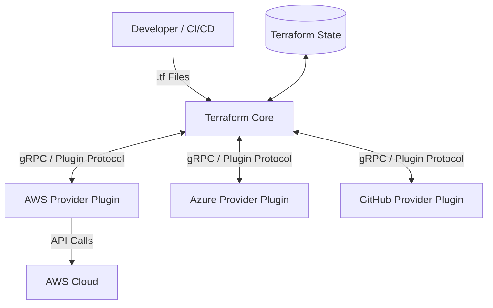

# 02. Terraform Architecture and Providers

## 🏗️ Core vs Plugins (Providers) Architecture

Terraform is logically split into two main components:



### 1. Terraform Core
- Compiled Go binary.
- Reads configuration files (`.tf`).
- Manages the **Dependency Graph**.
- Compares desired state against actual state (`.tfstate`).

### 2. Provider Plugins
- Communicate with Core over gRPC (Plugin Protocol v6).
- Translate Terraform requests into specific API calls (AWS API, GCP API, etc.).
- Downloaded during the `terraform init` phase.

---

## 🔒 `required_providers` Block (versions.tf)

In Terraform (v1.0+ and emphasized in 004), declaring provider source and version constraints is a **best practice requirement**:

```hcl
terraform {
  required_version = ">= 1.12.0"

  required_providers {
    aws = {
      source  = "hashicorp/aws"
      version = "~> 5.0"
    }
  }
}
```

---

## 💡 Typical 004 Exam Questions
1. *Which component makes direct API calls to AWS?*
   - The **Provider Plugin** (e.g., `hashicorp/aws`), not Terraform Core.
2. *When are provider plugins downloaded?*
   - During the execution of `terraform init`.
