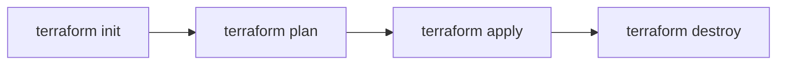

# 04. Terraform CLI Commands

## ⚙️ Core Workflow

### 1. `terraform init`
- Initializes working directory.
- Downloads required **Provider Plugins**.
- Initializes **Remote Backend** (e.g. S3).
- Downloads child modules from local/remote sources.

### 2. `terraform plan`
- Creates an execution plan **non-destructively**.
- Compares code (`.tf`) against state (`.tfstate`) and real cloud infrastructure.
- Displays actions: `+ add`, `~ change`, `- destroy`.

### 3. `terraform apply`
- Executes the planned changes in cloud provider APIs.
- Updates `.tfstate` file.
- Common CI/CD flag: `-auto-approve`.

### 4. `terraform destroy`
- Destroys **all** managed infrastructure in current state.

---

## 🛠️ Utility & Maintenance Commands

- **`terraform fmt`**: Formats HCL code to HashiCorp standard (`-recursive` for subdirectories).
- **`terraform validate`**: Checks syntax and data types locally without contacting cloud APIs.
- **`terraform state`**: Inspects or modifies state (`list`, `show`, `mv`, `rm`).
- **`terraform refresh`**: Updates state file with real cloud status (Note: `terraform plan` automatically performs a refresh).

---

## 💡 Typical 004 Exam Questions
1. *Does `terraform validate` require connection to cloud provider APIs?*
   - No. It only checks configuration file syntax locally.
2. *Which command automatically formats `.tf` files?*
   - `terraform fmt`.
