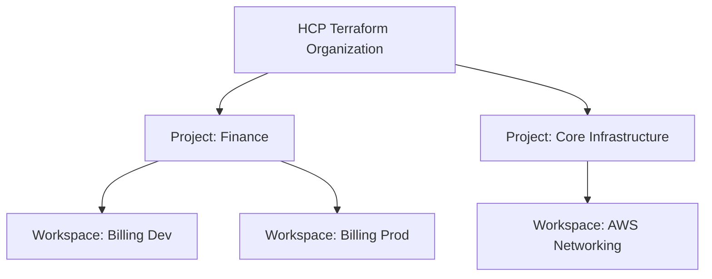

# 10. HCP Terraform (Cloud) Capabilities [004 Exam]

## ☁️ What is HCP Terraform?

HCP Terraform (formerly Terraform Cloud) is HashiCorp's managed SaaS platform providing team collaboration, policy enforcement, and automated CI/CD workflows for Terraform.

---

## 🏢 Hierarchy: Organizations, Projects, and Workspaces [NEW 004]

The 004 exam requires understanding the organizational hierarchy in HCP Terraform:

- **Organization**: Top-level entity grouping projects, teams, SSO, and billing.
- **Projects**: Group Workspaces logically to apply RBAC permissions across multiple workspaces simultaneously.
- **Workspaces**: Contain Terraform configuration code, state file history, and environment variables.

---

## 🛡️ Policy as Code: Sentinel vs OPA (Open Policy Agent)

HCP Terraform evaluates policy rules between `terraform plan` and `terraform apply`:

- **Sentinel**: HashiCorp's policy-as-code framework (e.g., "S3 buckets must be encrypted", "Disallow EC2 instances larger than t3.medium").
- **OPA (Open Policy Agent)**: Open-standard policy framework using Rego language, natively supported by HCP Terraform.

---

## 📦 HCP Terraform Private Registry

Enables organizations to share private modules and providers across internal teams securely.

---

## 💡 Typical 004 Exam Questions
1. *Which HCP Terraform hierarchy element groups multiple Workspaces to apply RBAC access policies?*
   - **Projects**.
2. *At what stage during HCP Terraform runs are Sentinel or OPA policies evaluated?*
   - Between `terraform plan` and `terraform apply`.
